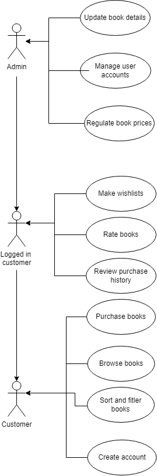
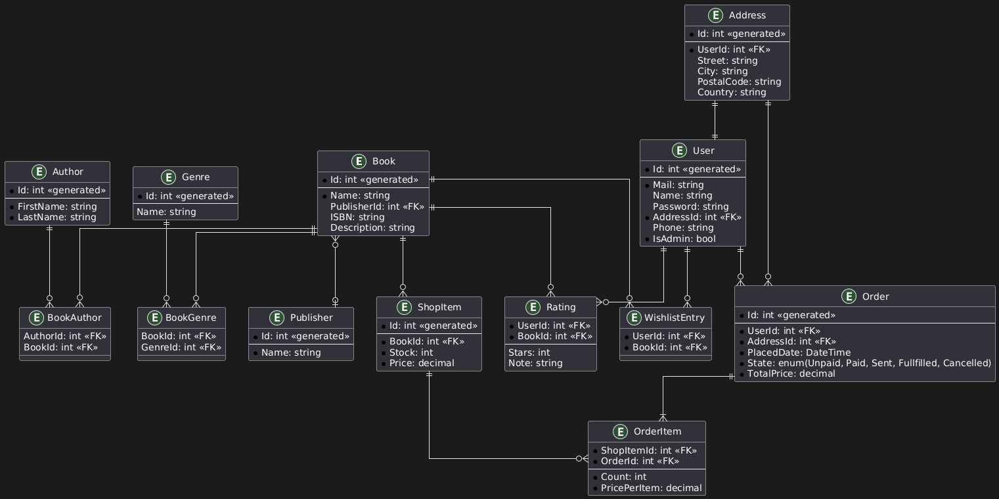

# PV179 Team 6 - BookHub


# BookHub Platform

## Overview

**BookHub** is a digital platform that allows users to browse and purchase books from a variety of genres. The platform includes features such as user accounts, purchase history, book ratings, wishlists, and administrative management of book details, user accounts, and pricing.

The application is built using **.NET 8** and follows REST API standards for interaction. Below, you will find instructions on how to run the application, along with technical details and architecture diagrams.

---

## Features

### For Customers:
- Browse books by name, description, price, category, and manufacturer.
- Create an account and review purchase history.
- Rate books and create wishlists.

### For Administrators:
- Manage book details (CRUD operations).
- Manage user accounts.
- Set and adjust book prices.

### Additional Requirements:
- **Caching**: A cache mechanism that refreshes every 30 minutes to improve response times.
- **Authentication Middleware**: Using a hard-coded access token for authentication.
- **Logging Middleware**: Logs all incoming requests.

---

## Technical Details

### Technology Stack:
- **.NET 8**
- **Entity Framework Core** for Data Access Layer (DAL)
- **SQL Server** for database
- **RESTful API** for communication

---

## Architecture Diagrams

### Use Case Diagram


### Data Model Diagram


---

## API Endpoints

Api endpoints can be discovered in the Swagger UI, which is available at `http://localhost:7064/swagger/index.html`.


## Authhentication

The application uses a hard-coded access token for authentication. The token is passed in the header of each request to authenticate the user. The token is validated by the authentication middleware before processing the request.

---

## Database Setup

The project uses **Entity Framework Core** for database interaction. Follow these steps to set up the database and seed data:

1. **Database Configuration**: Set the connection string in `appsettings.json`.
2. **Migrations**: Run the following command to apply database migrations:
    ```bash
    dotnet ef database update
    ```
3. **Seeding Data**: After setting up the database, the seeding process will automatically insert sample data into the database tables for books, users, and categories.

---

## Data Access Layer (DAL)

The DAL has been implemented using **Repository Pattern**. Each entity has its own repository, allowing for efficient interaction with the database.

---

## Caching Mechanism

A cache mechanism has been implemented using **MemoryCache** to store and refresh cached data every 10 minutes, ensuring fast response times.

---

## Running the Application

To run the application locally, follow these steps:

1. Clone the repository from GitLab:
    ```bash
    git clone https://gitlab.fi.muni.cz/xzatlouk/pv179-project.git
    ```
2. Install dependencies and build the solution:
    ```bash
    dotnet restore
    dotnet build
    ```
3. Run the application:
    ```bash
    dotnet run
    ```
4. The application will be available at `http://localhost:7064`.

---

## Logging

A custom middleware logs every incoming HTTP request, capturing essential information such as timestamps, request paths, and response times. This log is stored locally and can be configured to send logs to external services in the future.

---

## GitLab Repository

The project is hosted on a GitLab repository with internal visibility. You can clone the project using the link below:

```bash
git clone https://gitlab.fi.muni.cz/xzatlouk/pv179-project.git
```

---

## Conclusion

This is a robust digital platform tailored for managing and selling books. It is built with performance, security, and user experience in mind.

---

## Generative AI usage

The development of this project was supported by the use of generative AI. The AI-generated text and code was then reviewed and edited by the developers to ensure accuracy and completeness. 
The developers take full responsibility for the text and code generated by the AI.

## Developers
* [Jan Zatloukal](https://is.muni.cz/auth/osoba/chuck)
* [Jindrich Kadlcik](https://is.muni.cz/auth/osoba/497876)
* [Matej Drlik](https://is.muni.cz/auth/osoba/524982)
